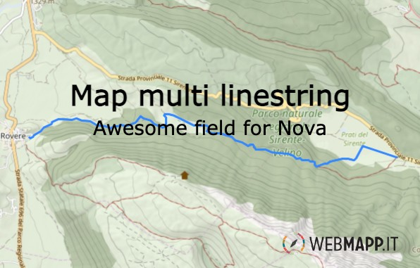

# map-multi-linestring


---

[](https://packagist.org/packages/wm/map-multi-linestring)

- [map-multi-linestring](#map-multi-linestring)
  - [Requirements](#requirements)
  - [Installation](#installation)
  - [Develop](#develop)
  - [Usage](#usage)
    - [Map Multi Linestring](#map-multi-linestring-1)
  - [Configuration](#configuration)

## Requirements

- `php: ^8`
- `laravel/nova: ^4`

## Installation

You can install the package in to a Laravel app that uses [Nova](https://nova.laravel.com) via composer:

```bash
composer require wm/map-multi-linestring
```
## Develop
create a```nova-components``` folder in the root of the project where you want to develop.
Clone map-multi-linestring inside.
add  in ``` "repositories"``` array  attribute of ```composer.json```  
```php 
        {
            "type": "path",
            "url": "./nova-components/map-multi-linestring"
        }
```

modify  in ``` "requires"``` object  attribute of ```composer.json```  
```php 
    "wm/map-multi-linestring": "*",
```
in the first time

launch inside the repository hosting the field
```bash
    cd vendor/laravel/nova && npm install
```
we need modify composer.lock 
launch
```bash
    composer update wm/map-multi-linestring
```

launch inside field
```bash
    npm install
```

## Usage

### Map Multi Linestring


You can display a post gist geography(MultiLineString,4326) area on the map and change it by uploading a new MultiLineString file (.GPX, .KML, .GEOJSON).
To use the Map Multi Linestring feature, include the MapMultiLinestring class and add it to your resource's fields. Customize the map settings by providing metadata such as the initial map center, tile server URL, attribution text, minimum and maximum zoom levels, default zoom level, GraphHopper API URL used to specify the URL of the GraphHopper API, and GraphHopper routing profile used by GraphHopper when calculating the route. Routing profiles determine the type of transportation mode and the set of rules that the routing engine will use. The default value for this field is 'foot', which means the routing will be optimized for walking. Other available profiles include 'bike' and 'hike'.

```php
    use Wm\MapMultiLinestring\MapMultiLinestring;
    /**
     * Get the fields displayed by the resource.
     *
     * @param  \Laravel\Nova\Http\Requests\NovaRequest  $request
     * @return array
     */
    public function fields(NovaRequest $request)
    {
        return [
            ID::make()->sortable(),
                ...
            MapMultiLinestring::make('geometry')->withMeta([
                'center' => [42, 10],
                'attribution' => '<a href="https://webmapp.it/">Webmapp</a> contributors',
                'tiles' => 'https://api.webmapp.it/tiles/{z}/{x}/{y}.png',
                'minZoom' => 5,
                'maxZoom' => 17,
                'defaultZoom' => 10,
                'graphhooper_api' => 'https://graphhopper.webmapp.it/route',
                'graphhoper_profile' => 'hike'
            ]),
        ];
    }
```
## Configuration

As of v1.4.0 it's possible to use a `Tab` class instead of an array to represent your tabs.

| Property         | Type      | Default                                                                   | Description                                                                                           |
|------------------|-----------|---------------------------------------------------------------------------|-------------------------------------------------------------------------------------------------------|
| center           | `array`   | `[0,0]`                                                                   | The coordinates used to center the view of an empty map.                                              |
| attribution      | `string`  | `<a href="https://www.openstreetmap.org/">OpenStreetMap</a> contributors, <a href="https://creativecommons.org/licenses/by-sa/2.0/">CC-BY-SA</a>, Imagery (c) <a href="https://www.mapbox.com/">Mapbox</a>` | The HTML content displayed as map attribution.                                                        |
| tiles            | `string`  | `https://{s}.tile.openstreetmap.org/{z}/{x}/{y}.png`                      | The tile URL used for the map.                                                                        |
| minZoom          | `integer` | `1`                                                                       | The minimum zoom level allowed on the map.                                                             |
| maxZoom          | `integer` | `19`                                                                      | The maximum zoom level allowed on the map.                                                             |
| defaultZoom      | `integer` | `10`                                                                      | The initial zoom level when the map is first displayed.                                                |
| graphhooper_api  | `string`  | `'https://graphhopper.webmapp.it/route'`                                   | The URL of the GraphHopper API used for routing requests.                                              |
| graphhoper_profile | `string` | `'foot'` | The routing profile used by GraphHopper for calculating the route. Default is optimized for walking `'foot'`. Other available profiles include `'bike'` and `'hike'`. |


